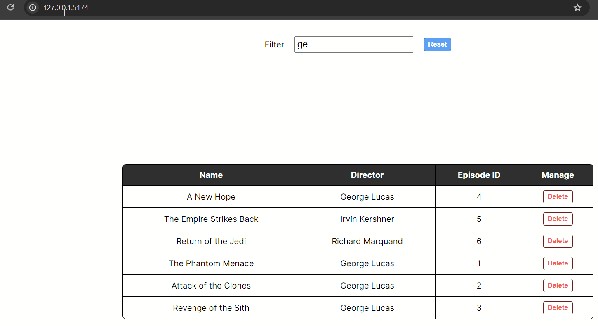
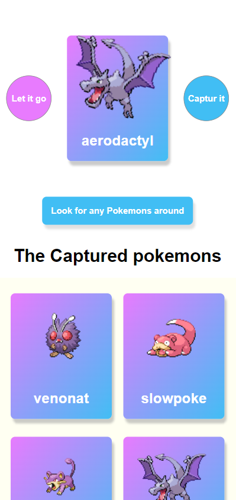

# Redi_JS_homework
# About

This repository contains a collection of mini React projects developed as part of the Redi School Intermediate JavaScript course 2024.

## Projects

### Movies

The `Movies` project is a collection of reusable React components for displaying and managing movies fetched from the Star Wars API (SWAPI). It consists of the following components:

- **MoviesTable**: A component to display movies in a table format.
- **SearchBar**: A component to filter movies by title, director, or episode ID.
- **Movies**: A container component that integrates the MoviesTable and SearchBar components to provide a complete movies management interface.

#### Features
- Fetches movies from the SWAPI.
- Allows filtering movies by title, director, or episode ID.
- Provides a loading spinner while fetching data.
- Displays a message when no movies match the filter criteria.
- Allows deleting movies from the list.

# Pokemon Card App

This application serves as a practice ground for utilizing `useEffect` hook and making API calls using `fetch` with `async`/`await` syntax in React.

[Preview on Codesandbox](https://codesandbox.io/p/devbox/pokemon-card-app-exercise-forked-qtcd7r?layout=%257B%2522sidebarPanel%2522%253A%2522GIT%2522%252C%2522rootPanelGroup%2522%253A%257B%2522direction%2522%253A%2522horizontal%2522%252C%2522contentType%2522%253A%2522UNKNOWN%2522%252C%2522type%2522%253A%2522PANEL_GROUP%2522%252C%2522id%2522%253A%2522ROOT_LAYOUT%2522%252C%2522panels%2522%253A%255B%257B%2522type%2522%253A%2522PANEL_GROUP%2522%252C%2522contentType%2522%253A%2522UNKNOWN%2522%252C%2522direction%2522%253A%2522vertical%2522%252C%2522id%2522%253A%2522clv4dgz550006356ixdim6qpl%2522%252C%2522sizes%2522%253A%255B72.8328611898017%252C27.167138810198296%255D%252C%2522panels%2522%253A%255B%257B%2522type%2522%253A%2522PANEL_GROUP%2522%252C%2522contentType%2522%253A%2522EDITOR%2522%252C%2522direction%2522%253A%2522horizontal%2522%252C%2522id%2522%253A%2522EDITOR%2522%252C%2522panels%2522%253A%255B%257B%2522type%2522%253A%2522PANEL%2522%252C%2522contentType%2522%253A%2522EDITOR%2522%252C%2522id%2522%253A%2522clv4dgz550002356ii57099qt%2522%257D%255D%257D%252C%257B%2522type%2522%253A%2522PANEL_GROUP%2522%252C%2522contentType%2522%253A%2522SHELLS%2522%252C%2522direction%2522%253A%2522horizontal%2522%252C%2522id%2522%253A%2522SHELLS%2522%252C%2522panels%2522%253A%255B%257B%2522type%2522%253A%2522PANEL%2522%252C%2522contentType%2522%253A%2522SHELLS%2522%252C%2522id%2522%253A%2522clv4dgz550004356iirp8h6sv%2522%257D%255D%252C%2522sizes%2522%253A%255B100%255D%257D%255D%257D%252C%257B%2522type%2522%253A%2522PANEL_GROUP%2522%252C%2522contentType%2522%253A%2522DEVTOOLS%2522%252C%2522direction%2522%253A%2522vertical%2522%252C%2522id%2522%253A%2522DEVTOOLS%2522%252C%2522panels%2522%253A%255B%257B%2522type%2522%253A%2522PANEL%2522%252C%2522contentType%2522%253A%2522DEVTOOLS%2522%252C%2522id%2522%253A%2522clv4dgz550005356iwj2zwaat%2522%257D%255D%252C%2522sizes%2522%253A%255B100%255D%257D%255D%252C%2522sizes%2522%253A%255B49.657022418087756%252C50.342977581912244%255D%257D%252C%2522tabbedPanels%2522%253A%257B%2522clv4dgz550002356ii57099qt%2522%253A%257B%2522tabs%2522%253A%255B%257B%2522id%2522%253A%2522clv4dgz550001356i5c3c45ja%2522%252C%2522mode%2522%253A%2522permanent%2522%252C%2522type%2522%253A%2522FILE%2522%252C%2522filepath%2522%253A%2522%252Fpackage.json%2522%252C%2522state%2522%253A%2522IDLE%2522%257D%255D%252C%2522id%2522%253A%2522clv4dgz550002356ii57099qt%2522%252C%2522activeTabId%2522%253A%2522clv4dgz550001356i5c3c45ja%2522%257D%252C%2522clv4dgz550005356iwj2zwaat%2522%253A%257B%2522id%2522%253A%2522clv4dgz550005356iwj2zwaat%2522%252C%2522activeTabId%2522%253A%2522clv4dhbpx005y356ievuhydrh%2522%252C%2522tabs%2522%253A%255B%257B%2522type%2522%253A%2522TASK_PORT%2522%252C%2522taskId%2522%253A%2522Development%2522%252C%2522port%2522%253A5173%252C%2522id%2522%253A%2522clv4dhbpx005y356ievuhydrh%2522%252C%2522mode%2522%253A%2522permanent%2522%252C%2522path%2522%253A%2522%252F%2522%257D%255D%257D%252C%2522clv4dgz550004356iirp8h6sv%2522%253A%257B%2522id%2522%253A%2522clv4dgz550004356iirp8h6sv%2522%252C%2522tabs%2522%253A%255B%257B%2522id%2522%253A%2522clv4dgz550003356ig3a6xprw%2522%252C%2522mode%2522%253A%2522permanent%2522%252C%2522type%2522%253A%2522TERMINAL%2522%252C%2522shellId%2522%253A%2522clv4dh0kn000ddcf82uwm6sx4%2522%257D%252C%257B%2522type%2522%253A%2522TASK_LOG%2522%252C%2522taskId%2522%253A%2522Development%2522%252C%2522id%2522%253A%2522clv4dh86i004u356i2qdpqkzc%2522%252C%2522mode%2522%253A%2522permanent%2522%257D%255D%252C%2522activeTabId%2522%253A%2522clv4dgz550003356ig3a6xprw%2522%257D%257D%252C%2522showDevtools%2522%253Atrue%252C%2522showShells%2522%253Atrue%252C%2522showSidebar%2522%253Atrue%252C%2522sidebarPanelSize%2522%253A15%257D)

## Components

### App

The primary component managing the state of captured Pokemon cards and rendering other components.

### Cards

Responsible for displaying individual Pokemon cards. It fetches details of the Pokemon based on the provided ID and renders the card with the Pokemon's image and name.

### HuntingBtn

A button component that triggers the hunting action to look for Pokemon. Clicking this button generates a random Pokemon ID for hunting.

### Message

Displays messages to the user, such as errors or notifications.

### Modal (Not Implemented Yet)

Will be used for displaying additional details or actions related to captured Pokemon cards. Currently not implemented.

## Features

- **Capturing Pokemon**: Users can click the "Look for any Pokemons around" button to hunt for Pokemon.
- **Displaying Pokemon Cards**: Captured Pokemon cards are displayed with their images and names.
- **Error Handling**: Error messages are displayed if there are issues fetching Pokemon data.
- **Loading Indicator**: A loading indicator is displayed while fetching Pokemon data.

## License

This project is licensed under the [MIT License](LICENSE).

